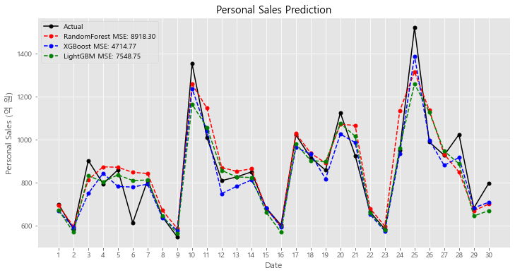
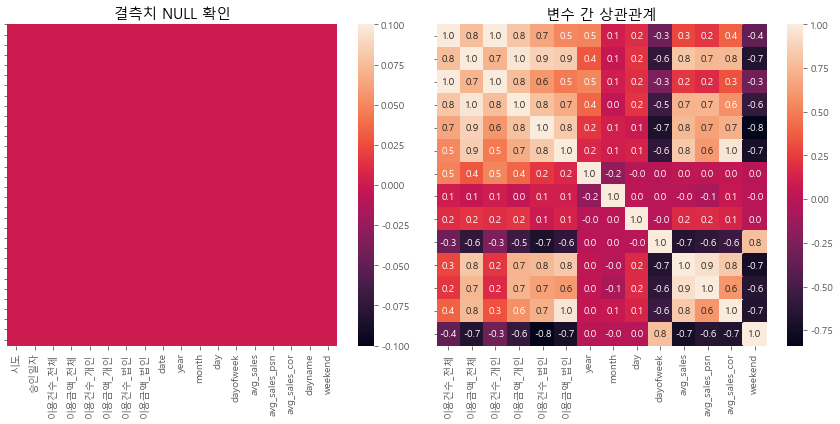
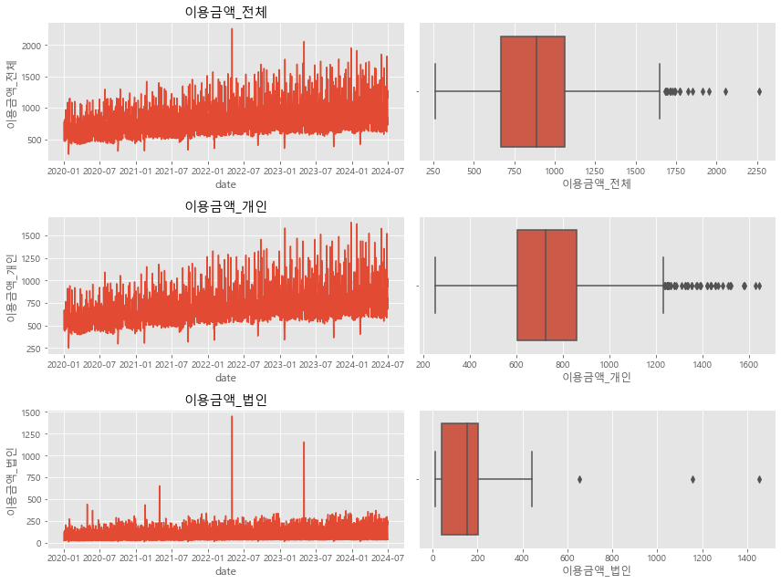
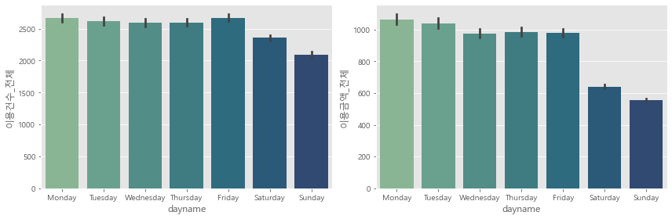
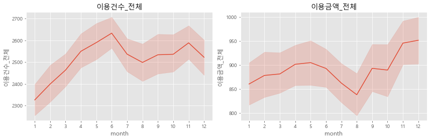

# 앙상블 모형 기반 신용카드 일별 매출 예측

  

## Summary
- **앙상블 모형은 일별 매출을 비교적 정확하게 예측한다.**  
  (월 매출 오차 약 460억, 전체 매출 대비 1.8%, 2024.06 예측 기준)
- **LightGBM** 모델이 가장 우수한 성능을 보였고  
  **XGBoost**와 **RandomForest** 모델도 비교적 높은 예측 정확도를 기록했다.
- 매출 예측에 **연도**, **월**, **요일** 등이 중요한 영향을 미친다.


## 1. 프로젝트 개요

이 프로젝트는 신용카드 일별 매출 데이터를 기반으로 미래 매출을 예측하고자 한다. 미래 매출 예측은 마케팅 캠페인 기획, 재무 계획 설립 등 다양한 사업 영역에서 활용한다. 

실제 업무 환경에서도 체계적인 매출 예측방법론이 존재하지 않고 담당자의 경험과 재량에 의존하는 경우도 많다. 체계적인 예측방법론 정립을 위해 **RandomForest**, **XGBoost**, **LightGBM** 3가지 머신러닝 모델을 사용하여 예측 성능을 비교하였다.


## 2. 데이터 로딩

### 데이터 출처
데이터는 **KDX 한국데이터거래소**에서 제공하는 **NH농협카드 일자별 소비현황_서울** 데이터셋을 사용한다. 데이터는 월별로 제공되며, 각 파일은 'YYYYMM' 형식으로 저장된다. 데이터 오너십을 가지고 있지 않아 리포지토리에는 제외하지만 아래 공개 데이터 링크에서 직접 다운받을 수 있다.

- **데이터명**: [NH농협카드] 일자별 소비현황_서울
- **URL**: [KDX 데이터 상세](https://kdx.kr/data/product-list?specs_id=MA38230007&corp_id=CORP000024&category_id=CA000004)

### 데이터 확인
- 훈련 데이터: 2020.01 ~ 2023.12
- 검증 데이터: 2024.01 ~ 2024.06
- 주요 컬럼은 카드 사용 금액과 건수, 승인 일자 등의 정보를 포함한다.

```python
# %% 1. LOAD THE DATA
# Data Source: KDX Data - [NH농협카드] 일자별 소비현황_서울

bas_ym = pd.date_range(start='20200101', end='20240630', freq='MS').strftime('%Y%m').tolist()

df = pd.DataFrame()

for i, var in enumerate(bas_ym):
    data_path = f'data/[NH농협카드] 일자별 소비현황_서울_{var}.csv'
    
    encodings = ['utf-8-sig', 'euc-kr', 'cp949']
    for encoding in encodings:
        try:
            tmp_df = pd.read_csv(data_path, encoding=encoding)
            break
        except UnicodeDecodeError:
            continue
    else:
        raise ValueError(f"Failed to read {data_path} with available encodings.")
    
    # Ensure no duplicate columns
    tmp_df = tmp_df.loc[:, ~tmp_df.columns.duplicated()]
    
    df = pd.concat([df, tmp_df], axis=0)
    
print(df.shape)
print(df.head())
```

## 3. 데이터 전처리

### 3.1. 데이터 타입 변환
- 승인일자를 `datetime64` 타입으로 변환하고 금액 변수들의 단위를 분석에 용이하게 변경한다.

### 3.2. 파생 변수 생성
- 연도(`year`), 월(`month`), 일(`day`), 요일(`dayofweek`), 주말 여부(`weekend`) 등의 파생 변수를 생성하여 모델에 활용할 수 있도록 한다.
- 금액의 평균을 나타내는 변수들도 분석 참고용으로 생성한다 (`avg_sales`, `avg_sales_psn`, `avg_sales_cor`).

```python
# Type Conversion (int64 -> datetime64)
df['date'] = pd.to_datetime(df['승인일자'], format='%Y%m%d')

# Decimal Point Handling (백만원 -> 억원)
df['이용금액_전체'] = df['이용금액_전체'] / 100
df['이용금액_개인'] = df['이용금액_개인'] / 100
df['이용금액_법인'] = df['이용금액_법인'] / 100

# Derived Variables
df['year'] = df['date'].dt.year
df['month'] = df['date'].dt.month
df['day'] = df['date'].dt.day
df['dayofweek'] = df['date'].dt.dayofweek
df['weekend'] = df['dayname'].isin(['Saturday', 'Sunday'])

df['avg_sales'] = df['이용금액_전체'] * 1000000 / df['이용건수_전체'] / 1000
df['avg_sales_psn'] = df['이용금액_개인'] * 1000000 / df['이용건수_개인'] / 1000
df['avg_sales_cor'] = df['이용금액_법인'] * 1000000 / df['이용건수_법인'] / 1000

# Nominal to Ordinal Variable
df['dayname'] = pd.Categorical(df['date'].dt.day_name(), 
                               categories=['Monday', 'Tuesday', 'Wednesday','Thursday', 'Friday', 'Saturday', 'Sunday'],
                               ordered=True)

# Nullity Check
print(df.isna().sum())

# Train-Test Split
df_train = df[df['year'] != 2024]
df_test = df[df['year'] == 2024]

print(df_train.shape, df_test.shape)

# Reset Index
df.reset_index(drop=True, inplace=True)
```

## 4. 데이터 탐색적 분석 (EDA)

### 4.1. 결측치 확인

  

- 데이터에서 결측치를 시각적으로 확인하고, 결측치를 적절히 처리한다.


### 4.2. 변수 간 상관관계 확인

- 상관 행렬을 통해 변수들 간의 상관관계를 확인하고, 다중공선성 문제를 방지하기 위해 일부 변수를 제거하거나 변형할 수 있다.
- 본 분석에서는 주요 독립변수인 연도(`year`), 월(`month`), 일(`day`) 간 상관성이 낮아 변수 제거는 시행하지 않았다. 

```python
# %% 3. EDA WITH VISUALIZATION
fig, axes = plt.subplots(nrows=1, ncols=2, figsize=(12,6))

# 3-1. Null Handling
sns.heatmap(df.isna(), ax=axes[0])
axes[0].set_title('결측치 NULL 확인')
axes[0].set_yticklabels([])

# 3-2. Correlation Matrix (Multicolinearity Check)
corr_mat = df.drop(['시도', '승인일자', 'dayname'], axis=1).corr()

sns.heatmap(corr_mat, annot=True, fmt='.1f', ax=axes[1])
axes[1].set_yticklabels([])

axes[1].set_title('변수 간 상관관계')
plt.tight_layout()
plt.show()
```

### 4.3. 이상치 탐지

  

- 주요 변수들에 대해 선형 그래프와 박스플롯을 사용하여 이상치를 탐지하고, 이를 시각적으로 확인한다.

### 4.4. 매출 분석

  
  

- 매출 데이터는 요일별, 월별로 시각화하여 소비 패턴을 분석한다. 이를 통해 매출이 특정 요일이나 월에 따라 차이를 보인다는 인사이트를 도출한다.

```python
# 3-3. Outlier Detection
fig, axes = plt.subplots(nrows=3, ncols=2, figsize=(12,9))

variables = ['이용금액_전체', '이용금액_개인', '이용금액_법인']

for i, vars in enumerate(variables):
    sns.lineplot(data=df, x='date', y=vars,
                ax=axes[i%3][0])
    sns.boxplot(data=df, x=vars,
                ax=axes[i%3][1])
    axes[i%3][0].set_title(vars)

    plt.tight_layout()

fig.suptitle('')
plt.show()
```

## 5. 모델링

### 5.1. 회귀 모델 설정

- 모델링을 위해 **RandomForest**, **XGBoost**, **LightGBM**을 사용하여 예측을 수행한다. 
- 각 모델은 카드 사용 금액(‘이용금액_개인’)을 종속 변수로 설정하고, 연도, 월, 요일 등의 변수를 독립 변수로 설정하여 학습한다.

```python
# %% 4. Regression Model Specification
from sklearn.model_selection import train_test_split
from sklearn.ensemble import RandomForestRegressor
from xgboost import XGBRegressor
from lightgbm import LGBMRegressor

# 4-1. Train-Validation Split
ind_vars = ['승인일자', 'year', 'month', 'day', 'dayofweek']
dep_vars = ['이용건수_개인', '이용건수_법인', '이용금액_개인', '이용금액_법인']

X = df[df['year'] != 2024][ind_vars]
y = df[df['year'] != 2024][dep_vars]

X_train, X_valid, y_train, y_valid = train_test_split(X, y,
                                                      test_size=0.2, 
                                                      random_state=42
                                                      )
print(X_train.shape, y_train.shape)
print(X_valid.shape, y_valid.shape)
```

### 5.2. 모델 학습

- **RandomForestRegressor**는 1000개의 트리와 최대 깊이 20으로 설정하고,
- **XGBRegressor**와 **LGBMRegressor**는 기본 하이퍼파라미터를 사용하여 학습한다.

```python
# 4-2. Machine Learning (RandomForest, XGBoost, LightGBM)
dep_var = '이용금액_개인'

model_rf = RandomForestRegressor(n_estimators=1000,
                                max_depth=20,
                                random_state=42)
model_rf.fit(X_train, y_train[dep_var])

model_xgb =

 XGBRegressor(n_estimators=1000, random_state=42)
model_xgb.fit(X_train, y_train[dep_var])

model_lgbm = LGBMRegressor(n_estimators=1000, random_state=42)
model_lgbm.fit(X_train, y_train[dep_var])
```

### 5.3. 모델 성능 평가

- 평가 지표로 **MSE (Mean Squared Error)**를 사용하여 각 모델의 성능을 비교한다.

```python
# %% 4-3. Model Evaluation - MSE
from sklearn.metrics import mean_squared_error

# RF Model
y_pred_rf = model_rf.predict(X_valid)
mse_rf = mean_squared_error(y_valid[dep_var], y_pred_rf)

# XGB Model
y_pred_xgb = model_xgb.predict(X_valid)
mse_xgb = mean_squared_error(y_valid[dep_var], y_pred_xgb)

# LightGBM Model
y_pred_lgbm = model_lgbm.predict(X_valid)
mse_lgbm = mean_squared_error(y_valid[dep_var], y_pred_lgbm)

# Display MSE
print(f'RandomForest MSE: {mse_rf:.4f}')
print(f'XGBoost MSE: {mse_xgb:.4f}')
print(f'LightGBM MSE: {mse_lgbm:.4f}')
```

### 5.4. 모델 시각화

- 각 모델의 예측 결과를 시각화하여 실제 값과 예측 값을 비교한다.

```python
# %% 4-4. Model Predictions Visualization
fig, axes = plt.subplots(1, 3, figsize=(15, 5))

# RF Prediction
sns.lineplot(x=y_valid.index, y=y_valid[dep_var], ax=axes[0], label="Actual", color='blue')
sns.lineplot(x=y_valid.index, y=y_pred_rf, ax=axes[0], label="Predicted", color='red')
axes[0].set_title('RandomForest')

# XGB Prediction
sns.lineplot(x=y_valid.index, y=y_valid[dep_var], ax=axes[1], label="Actual", color='blue')
sns.lineplot(x=y_valid.index, y=y_pred_xgb, ax=axes[1], label="Predicted", color='red')
axes[1].set_title('XGBoost')

# LightGBM Prediction
sns.lineplot(x=y_valid.index, y=y_valid[dep_var], ax=axes[2], label="Actual", color='blue')
sns.lineplot(x=y_valid.index, y=y_pred_lgbm, ax=axes[2], label="Predicted", color='red')
axes[2].set_title('LightGBM')

plt.tight_layout()
plt.show()
```

  


## 6. 모델 해석

### 6.1. 특성 중요도 분석

- **LightGBM** 모델을 사용하여 각 특성의 중요도를 분석하고, 주어진 특성들 중 중요한 영향을 미친 변수들을 시각적으로 확인한다.

```python
# %% 5-1. Feature Importance
importances = model_lgbm.feature_importances_
feature_names = X_train.columns

# Feature Importance Visualization
fig, ax = plt.subplots(figsize=(10,6))
sns.barplot(x=importances, y=feature_names, ax=ax)
ax.set_title('Feature Importance - LightGBM')
plt.tight_layout()
plt.show()
```

## 7. 결론 및 향후 계획

### 7.1. 결론

- **LightGBM** 모델이 가장 우수한 성능을 보였고, **XGBoost**와 **RandomForest** 모델도 비교적 높은 예측 정확도를 기록했다.
- 주요 변수인 **연도**, **월**, **요일** 등이 매출 예측에 중요한 영향을 미친다는 것을 확인할 수 있었다.

### 7.2. 향후 계획

- 모델 성능을 개선하기 위해 **하이퍼파라미터 튜닝** 및 **특성 엔지니어링**을 추가적으로 진행할 예정이다.
- 더 많은 데이터를 활용하여 모델의 성능을 향상시킬 수 있을 것으로 기대된다.

## 8. 참고 문헌

- **LightGBM**, **XGBoost**, **RandomForest** 관련 문서 및 API 참조.